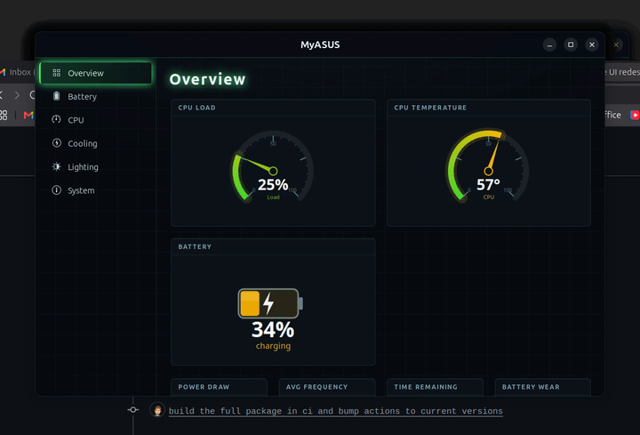
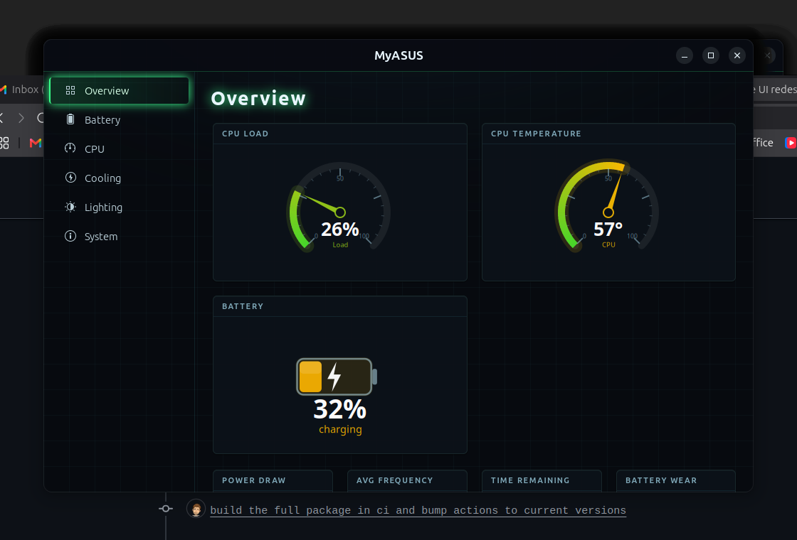
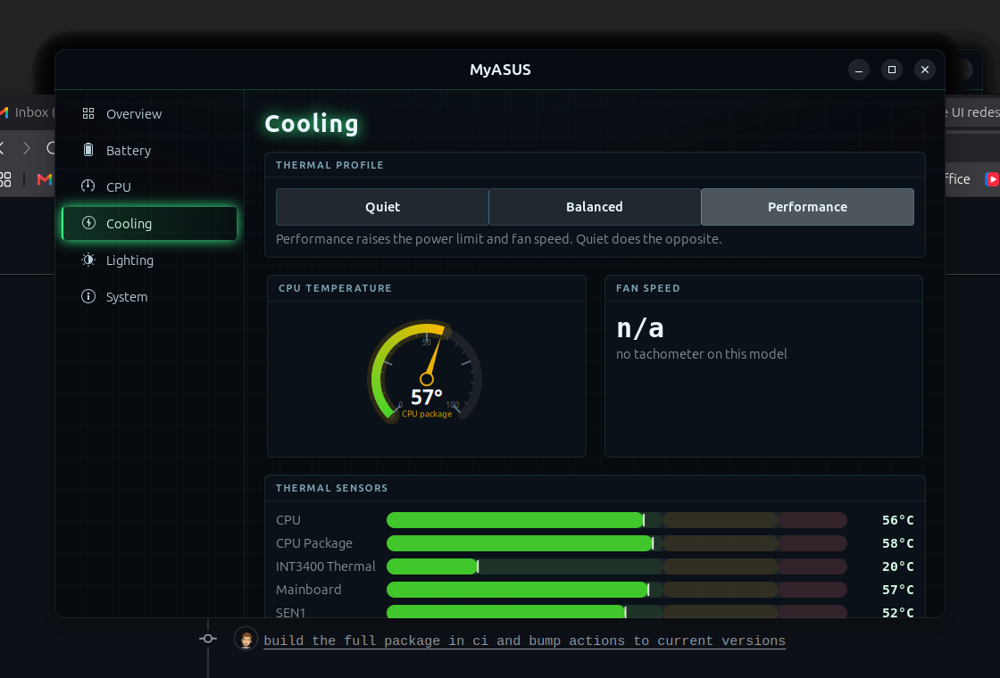
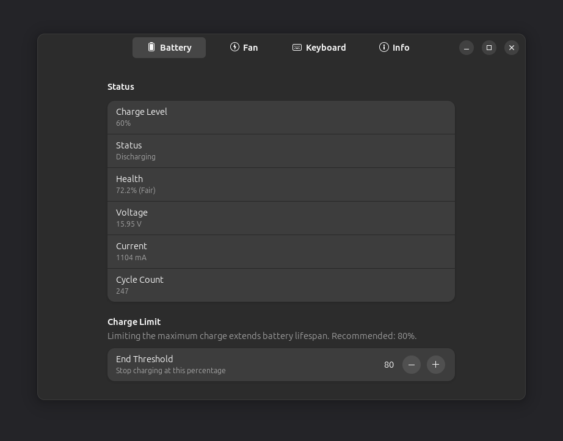
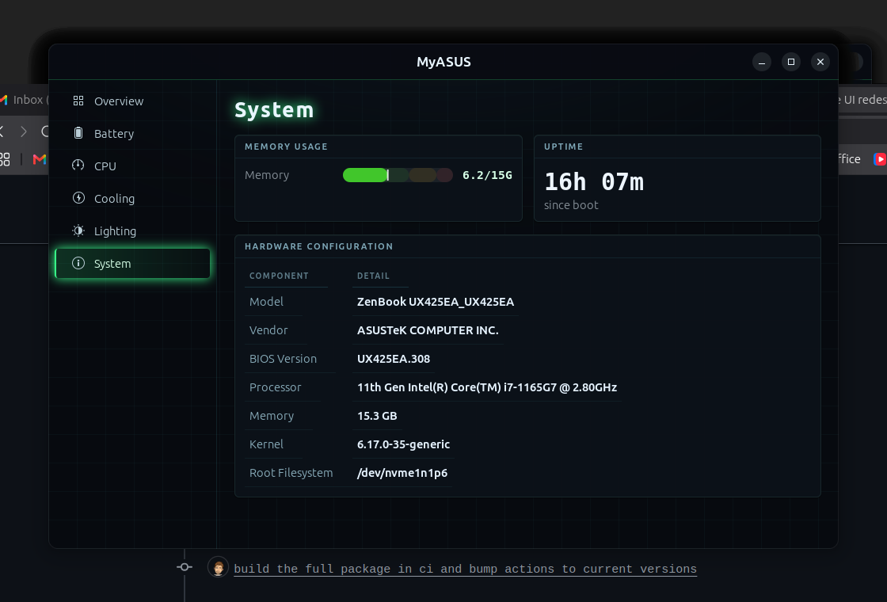

# myasus4linux

A native Linux app for ASUS notebooks — a clean GTK4 replacement for the
Windows-only MyASUS tool. It pairs a dense live dashboard (CPU load and
temperature, per-core meters, every thermal sensor, battery flow) with the
hardware controls you actually use: battery charge limit, fan/thermal profile,
keyboard and screen backlight.

It talks to the kernel's `asus-nb-wmi` driver through sysfs, so it runs on any
ASUS laptop with a mainline kernel (ZenBook, VivoBook, ExpertBook, ProArt, ROG,
TUF). Controls your model does not expose are detected at startup and hidden.



<table>
  <tr>
    <td></td>
    <td></td>
  </tr>
  <tr>
    <td></td>
    <td></td>
  </tr>
</table>

## Features

- **Overview**: live radial gauges (CPU load, temperature), a battery cell,
  per-core load meters, every thermal sensor, and trend charts
- **Battery**: charge limit, level, health, cycle count, voltage, current,
  power flow, time remaining
- **CPU**: per-core load and frequency, total-load and temperature trends
- **Cooling**: Quiet / Balanced / Performance profile, CPU temperature, all
  thermal sensors
- **Lighting**: keyboard backlight (Off, Low, Medium, High) and screen brightness
- **System**: model, CPU, RAM, kernel, BIOS, plus live memory usage and uptime

The charge limit persists across reboots: the `myasusd` daemon records it on
every write and re-applies it at startup, before any GUI runs.

## How privileged controls work

Reading hardware is unprivileged — the GUI never runs as root. Writes (fan
profile, charge limit, keyboard backlight) go through **`myasusd`**, a small
D-Bus system service that runs as root, validates every request, and only ever
writes a fixed set of sysfs paths. It's authorized by polkit and, for the active
local user, configured for no password prompt (the same model as
`power-profiles-daemon`), so controls just work. Screen brightness uses a logind
`uaccess` rule, like the desktop's own brightness keys.

## Safeguards

Charge limit defaults to 80% and is never allowed below 40%. Fans cannot be
fully disabled. Every change is reversible; nothing is written permanently.

## Build and install

Requirements: Rust 1.85+, the GTK4 and libadwaita development headers, Meson and
Ninja.

Run the GUI from source (it talks to an installed `myasusd`):

```bash
sudo apt install libgtk-4-dev libadwaita-1-dev meson ninja-build
cargo run --release
```

Full install — GUI plus the `myasusd` daemon and its D-Bus, polkit, systemd and
udev integration:

```bash
meson setup build
meson compile -C build
sudo meson install -C build
```

Distro packages (`.deb`, AUR) are the recommended way to ship this, since the
daemon is installed system-side. A Flatpak can carry the GUI but not the daemon.

## Tested on

| Component | Value |
| --- | --- |
| Device | ASUS ZenBook UX425EA |
| BIOS | UX425EA.308 |
| CPU | Intel Core i7-1165G7 |
| Memory | 16 GB |
| OS | Ubuntu 24.04 LTS |
| Desktop | GNOME on X11 |
| Kernel | 6.17.0-35-generic |
| Rust | 1.94 |

All six pages were confirmed reading live hardware, and a privileged write was
verified end to end through the daemon, with no password prompt.

## License

GPL-3.0-or-later. See [LICENSE](LICENSE).
