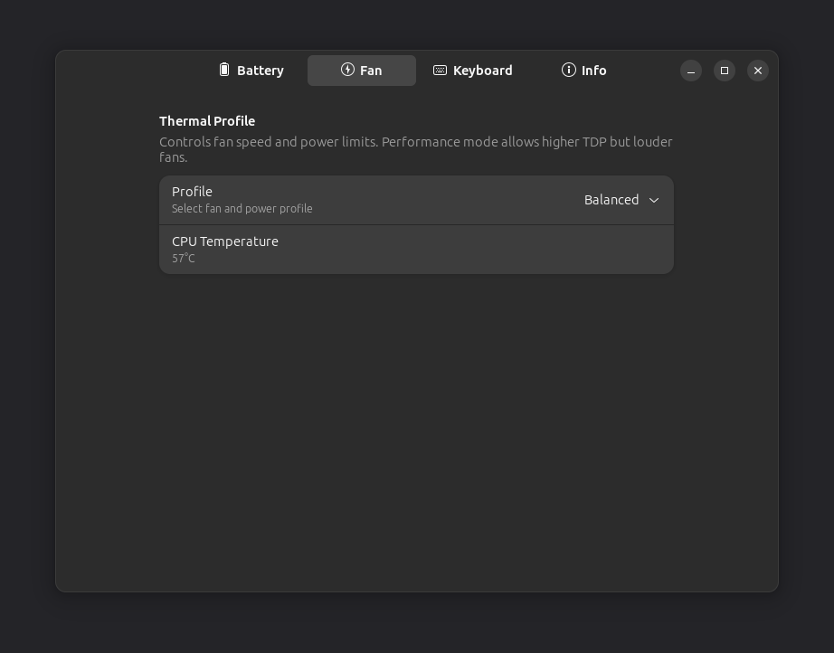
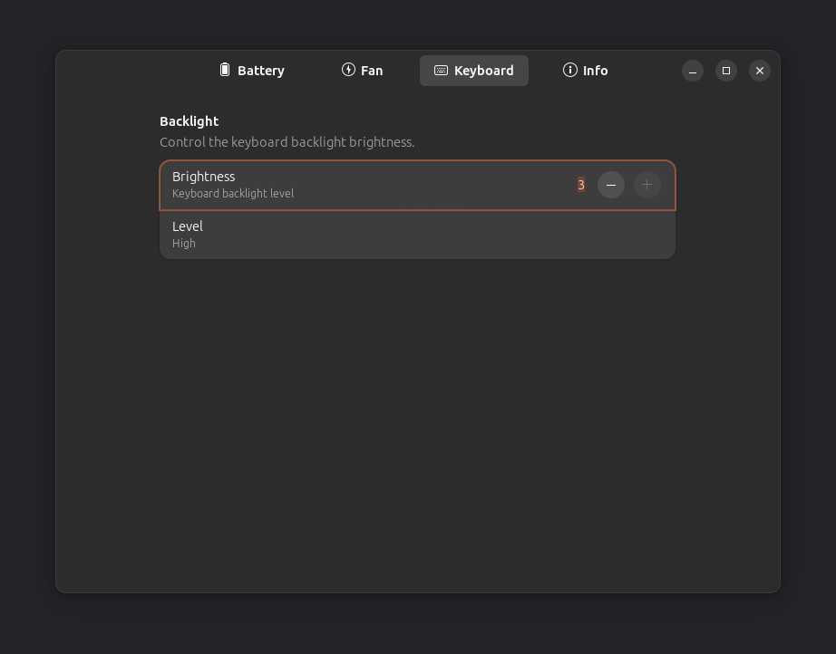
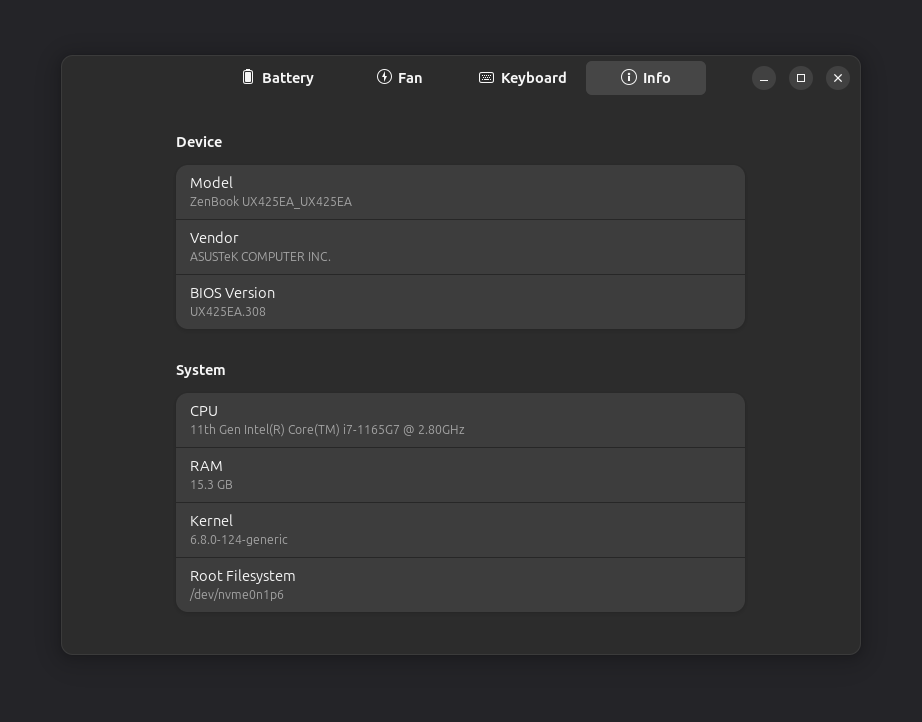

# myasus4linux

A native Linux app for ASUS notebooks. It replaces the Windows-only MyASUS tool
with a clean GTK4 interface for the hardware controls you actually use: battery
charge limit, fan profile, keyboard backlight, and system info.

It talks to the kernel's `asus-nb-wmi` driver through sysfs, so it runs on any
ASUS laptop with a mainline kernel (ZenBook, VivoBook, ExpertBook, ProArt, ROG,
TUF). Controls your model does not expose are detected at startup and hidden.

<table>
  <tr>
    <td></td>
    <td></td>
  </tr>
  <tr>
    <td></td>
    <td></td>
  </tr>
</table>

## Features

- **Battery**: charge limit, charge level, health, cycle count, voltage, current
- **Fan**: Quiet, Balanced, or Performance profile with live CPU temperature
- **Keyboard**: backlight brightness (Off, Low, Medium, High)
- **Info**: model, CPU, RAM, kernel, BIOS version

The charge limit persists across reboots through a one-shot systemd service that
re-applies your saved value at boot.

## Safeguards

The charge limit defaults to 80 percent and is never allowed below 40 percent.
Fans cannot be fully disabled. Every change is reversible and nothing is written
permanently. Privileged sysfs writes go through polkit, so you are prompted to
authenticate when changing a setting.

## Build

Requirements: Rust 1.85 or newer, plus the GTK4 and libadwaita development
headers.

```bash
sudo apt install libgtk-4-dev libadwaita-1-dev   # Debian and Ubuntu
cargo build --release
./target/release/myasus4linux
```

## Tested on

Verified working on this machine:

| Component | Value |
| --- | --- |
| Device | ASUS ZenBook UX425EA |
| BIOS | UX425EA.308 |
| CPU | Intel Core i7-1165G7 |
| Memory | 16 GB |
| OS | Ubuntu 24.04.2 LTS |
| Desktop | GNOME on X11 |
| Kernel | 6.8.0-124-generic |
| GTK / libadwaita | 4.14.5 / 1.5.0 |
| Rust | 1.94.0 |

All four pages were confirmed reading live hardware values, and the privileged
write path was confirmed through polkit.

## License

GPL-3.0-or-later. See [LICENSE](LICENSE).
